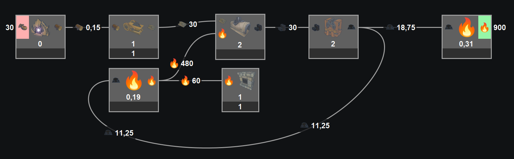
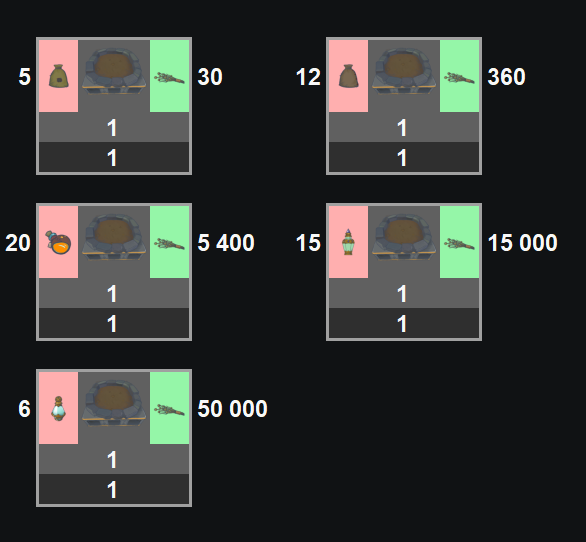
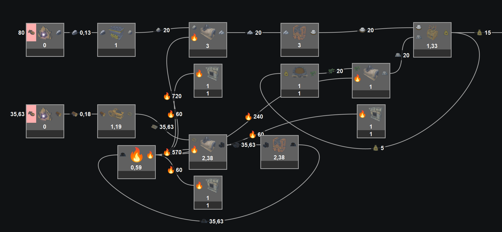
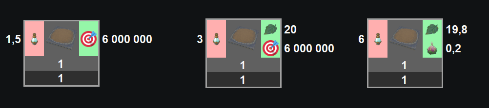

# SatisfactoryModelerAddons
ajout des données de jeux et icones (Star Rupture, Alchemy Factory) pour Satisfactory Modeler

# Utilisation

- Compilez et lancez l'exe, il va générer les fichiers de données dans dataouts
- Le fichier game_datas.json sera écrasé dans Satisfactory Modeler, donc pensez d'abord à le sauver si vous voulez faire machine arrière (ou réinstallez l'application)
- Copiez/écrasez les dossiers game_datas et images dans le répertoire de Satisfactory Modeler
- Lancez Satisfactory Modeler et tapez "SR" ou "AF" pour les recttes des 2 jeux
- Enjoy !

# Notes pour Alchemy Factory
Ce jeu possède beaucoup de paramètres variables qui s'adaptent mal à Satisfactory Modeler.
J'ai donc dû passer par des adaptations pour rendre le calcul le plus simple possible

## Système de chaleur (heat)

pour avoir les bons calculs, vous devez passer par les briques intermédiaires .
Convertissez votre carburant en chaleur, puis distribuez la chaleur aux machines qui en ont besoin.
N'oubliez pas d'ajouter autant de fours et hauts fourneaux (blast furnace) que necessaires (vous devrez calculer manuellement le nombre).

## Système de fertilisant

Les débits des recettes dépendent du type de fertilsant utilisé (je ne tient pas compte de la limitation du débit de sortie que calcule aussi le jeu en fonction de la vitesse des convoyeurs, attention à ce point !).
Vous devez donc choisir la bonne recette avec le fertilisant que vous voulez utiliser.

Exemple complet d'un générateur de basic fertilizer.

## World Tree

Cette machine peut prendre les 5 fertilisants et possède 3 états : Sapling, Mature, Max Size.

Le "next step" (target), 6 000 000, n'est qu'un rappel du nombre de points à alimenter pour pouvoir passer à la prochaine étape.

# TODO

## Alchemy Factory

- vérifier toutes les recettes
- le cout en item des machines
- le système de boutique avec les ventes des items
- les bonus de l'arbre de recherche
- une recette par défaut pour le paradox crucible
- le chaudron (aucune idée de comment le faire simplement)
- le bonus de hauteur avec l'extracteur avancé (utiliser les sommerloops ?)
